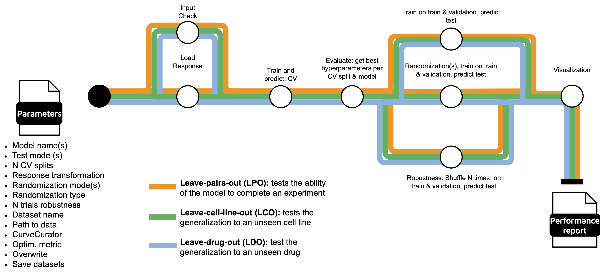

<h1>
  <picture>
    <source media="(prefers-color-scheme: dark)" srcset="docs/images/nf-core-drugresponseeval_logo_dark.png">
    
  </picture>
</h1>

[](https://github.com/nf-core/drugresponseeval/actions/workflows/ci.yml)
[](https://github.com/nf-core/drugresponseeval/actions/workflows/linting.yml)
[](https://nf-co.re/drugresponseeval/results)
[](https://doi.org/10.5281/zenodo.XXXXXXX)
[](https://www.nf-test.com)

[](https://www.nextflow.io/)
[](https://docs.conda.io/en/latest/)
[](https://www.docker.com/)
[](https://sylabs.io/docs/)
[](https://cloud.seqera.io/launch?pipeline=https://github.com/nf-core/drugresponseeval)

[](https://twitter.com/nf_core)
[](https://mstdn.science/@nf_core)
[](https://www.youtube.com/c/nf-core)

# 

## Introduction

**DrEval** is a bioinformatics framework which includes a PyPI package (drevalpy) and a Nextflow
pipeline (this repo). DrEval ensures that evaluations are statistically sound, biologically
meaningful, and reproducible. DrEval simplifies the implementation of drug response prediction
models, allowing researchers to focus on advancing their modeling innovations by automating
standardized evaluation protocols and preprocessing workflows. With DrEval, hyperparameter
tuning is fair and consistent. With its flexible model interface, DrEval supports any model type,
ranging from statistical models to complex neural networks. By contributing your model to the
DrEval catalog, you can increase your work's exposure, reusability, and transferability.

# 

<!-- TODO nf-core:
   Complete this sentence with a 2-3 sentence summary of what types of data the pipeline ingests, a brief overview of the
   major pipeline sections and the types of output it produces. You're giving an overview to someone new
   to nf-core here, in 15-20 seconds. For an example, see https://github.com/nf-core/rnaseq/blob/master/README.md#introduction
-->

<!-- TODO nf-core: Include a figure that guides the user through the major workflow steps. Many nf-core
     workflows use the "tube map" design for that. See https://nf-co.re/docs/contributing/design_guidelines#examples for examples.   -->
<!-- TODO nf-core: Fill in short bullet-pointed list of the default steps in the pipeline -->

1. The response data is loaded
2. All models are trained and evaluated in a cross-validation setting
3. For each CV split, the best hyperparameters are determined using a grid search per model
4. The model is trained on the full training set (train & validation) with the best
   hyperparameters to predict the test set
5. If randomization tests are enabled, the model is trained on the full training set with the best
   hyperparameters to predict the randomized test set
6. If robustness tests are enabled, the model is trained N times on the full training set with the
   best hyperparameters
7. Plots are created summarizing the results

For baseline models, no randomization or robustness tests are performed.

## Usage

> [!NOTE]
> If you are new to Nextflow and nf-core, please refer to [this page](https://nf-co.re/docs/usage/installation) on how to set-up Nextflow. Make sure to [test your setup](https://nf-co.re/docs/usage/introduction#how-to-run-a-pipeline) with `-profile test` before running the workflow on actual data.

Now, you can run the pipeline using:

<!-- TODO nf-core: update the following command to include all required parameters for a minimal example -->

```bash
nextflow run nf-core/drugresponseeval \
   -profile <docker/singularity/.../institute> \
   --models <model1,model2,...> \
   --baselines <baseline1,baseline2,...> \
   --dataset_name <dataset_name> \
   --path_data <path_data> \
```

> [!WARNING]
> Please provide pipeline parameters via the CLI or Nextflow `-params-file` option. Custom config files including those provided by the `-c` Nextflow option can be used to provide any configuration _**except for parameters**_; see [docs](https://nf-co.re/docs/usage/getting_started/configuration#custom-configuration-files).

For more details and further functionality, please refer to the [usage documentation](https://nf-co.re/drugresponseeval/usage) and the [parameter documentation](https://nf-co.re/drugresponseeval/parameters).

## Pipeline output

To see the results of an example test run with a full size dataset refer to the [results](https://nf-co.re/drugresponseeval/results) tab on the nf-core website pipeline page.
For more details about the output files and reports, please refer to the
[output documentation](https://nf-co.re/drugresponseeval/output).

## Credits

nf-core/drugresponseeval was originally written by Judith Bernett (TUM) and Pascal Iversen (FU
Berlin).

We thank the following people for their extensive assistance in the development of this pipeline:

<!-- TODO nf-core: If applicable, make list of people who have also contributed -->

## Contributions and Support

If you would like to contribute to this pipeline, please see the [contributing guidelines](.github/CONTRIBUTING.md).

For further information or help, don't hesitate to get in touch on the [Slack `#drugresponseeval` channel](https://nfcore.slack.com/channels/drugresponseeval) (you can join with [this invite](https://nf-co.re/join/slack)).

## Citations

<!-- TODO nf-core: Add citation for pipeline after first release. Uncomment lines below and update Zenodo doi and badge at the top of this file. -->
<!-- If you use nf-core/drugresponseeval for your analysis, please cite it using the following doi: [10.5281/zenodo.XXXXXX](https://doi.org/10.5281/zenodo.XXXXXX) -->

<!-- TODO nf-core: Add bibliography of tools and data used in your pipeline -->

An extensive list of references for the tools used by the pipeline can be found in the [`CITATIONS.md`](CITATIONS.md) file.

You can cite the `nf-core` publication as follows:

> **The nf-core framework for community-curated bioinformatics pipelines.**
>
> Philip Ewels, Alexander Peltzer, Sven Fillinger, Harshil Patel, Johannes Alneberg, Andreas Wilm, Maxime Ulysse Garcia, Paolo Di Tommaso & Sven Nahnsen.
>
> _Nat Biotechnol._ 2020 Feb 13. doi: [10.1038/s41587-020-0439-x](https://dx.doi.org/10.1038/s41587-020-0439-x).
